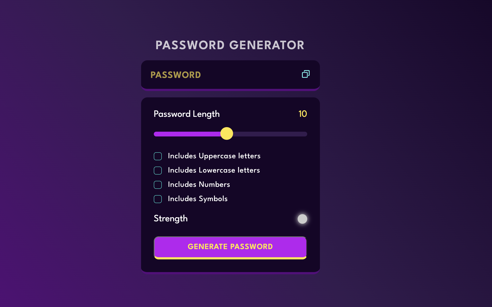
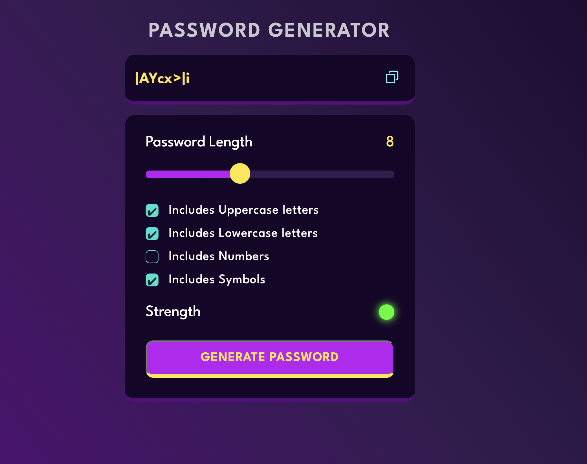

# Password Generator 

This is a simple implementation of a password generator using HTML, CSS, and JavaScript with the *Fisher Yates Algorithm for shuffling* the generated passwords.

## Getting Started

To get a copy of this project up and running on your local machine, clone the repository to your local machine using the command below:
### git clone https://github.com/lakshyadeepgogoi/Random-Password-Generator.git

## Usage

1. Open the index.html file in your web browser.
2. Select the password length using the slider.
3. Select the desired character types for the password (uppercase, lowercase, numbers, and special characters).
4. Click the "Generate Password" button.
5. The generated password will appear in the text box. 
6. If you want to shuffle the password, click on the "Shuffle Password" button.

## Contributing

Please feel free to submit pull requests or raise issues about the project. Contributions are always welcome!

## License

This project is licensed under the MIT License - see the [LICENSE](LICENSE) file for details.
